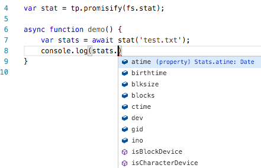

# typed-promisify
Typescript promise helpers: promisify(), map(), and _try(). You will need ES6 promises. These helpers preserve types in the promises, enabling better typechecking and VS Code intellisense:



## API

```typescript
import * as tp from 'typed-promisify';
```

### promisify(fn)

Convert a node style callback function to one returning a promise.

Example:
```typescript
var stat = tp.promisify(fs.stat);

stat('test.txt')
    .then(stats => console.log(stats));
```

### map(elts, fn)

Promise aware map.

Elts can be a promise for an array, an array of promises, or a promise for an array of promises. Fn can be synchronous or return a promise.

Returns a promises that resolves when all applied promises resolve (similar to Promise.all).

Example:
```typescript
var stat = tp.promisify(fs.stat);
var elts = ['test.txt', 'test2.txt'];

tp.map(elts, stat)
    .then(stats => console.log(stats));
```

### _try(fn, arg1, arg2...)

Call a synchronous function to kick off a promise chain.

Example:
```typescript
tp._try(fs.writeFileSync, 'test.txt', 'hello world')
    .then(() => {
        //do other stuff
    })
    .then(() => console.log('sucess'))
    .catch(err => console.log('failure'));
```